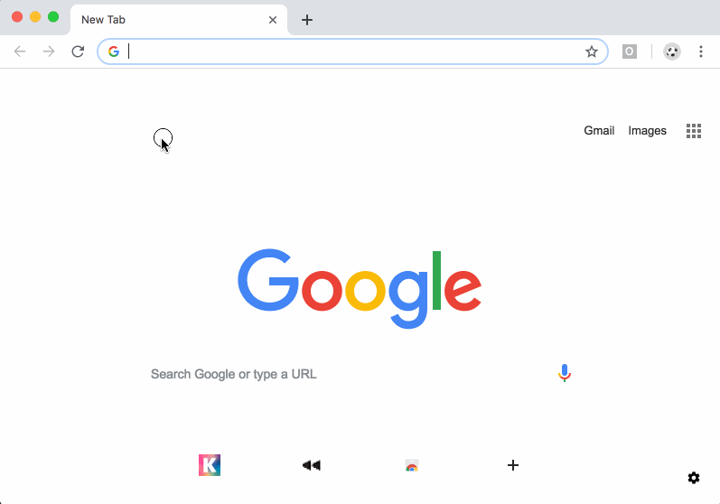

# Omnibox Page Colorizer

This demonstrates the "omnibox" API.

After installing this extension, type "color" followed by the <kbd>tab</kbd> key.
Then type a color, and the extension will change the existing page's background color.
The extension will auto-populate three suggestions, as well.

Uses the `chrome.tabs.executeScript` API and the "activeTab" permission so that it can
execute code in the active tab.

